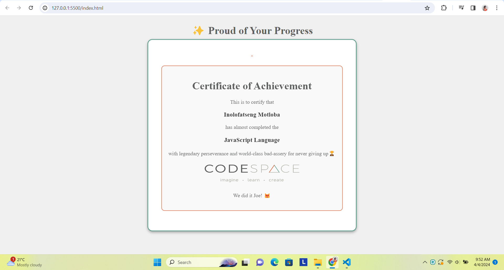

# [JSL07] Submission: Proud of your Progress

## Overview
In this challenge, I created a personalized certificate of achievement with the "Proud of Your Progress Certificate Generator". This web application requires users to input their name, a personalized message, and the course name to dynamically generate a certificate displayed in a modal

## Project Features
- **Input Fields:** For user's name, personalized message, and course name.
- **Generate Certificate:** A button that when clicked, creates the certificate.
- **Modal Display:** The certificate is shown in a modal window.
- **Close Button:** For closing the modal.
- **Validation:** Checks that all fields are completed before certificate generation.

